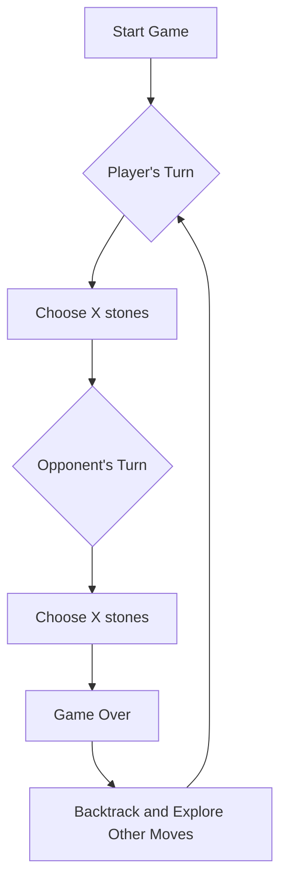

<h2><a href="https://leetcode.com/problems/stone-game-ii">1140. Stone Game II</a></h2>

<p>Alice and Bob continue their games with piles of stones. There are a number of piles <strong>arranged in a row</strong>, and each pile has a positive integer number of stones <code>piles[i]</code>. The objective of the game is to end with the most stones.</p>

<p>Alice and Bob take turns, with Alice starting first.</p>

<p>On each player's turn, that player can take <strong>all the stones</strong> in the <strong>first</strong> <code>X</code> remaining piles, where <code>1 &lt;= X &lt;= 2M</code>. Then, we set <code>M = max(M, X)</code>. Initially, M = 1.</p>

<p>The game continues until all the stones have been taken.</p>

<p>Assuming Alice and Bob play optimally, return the maximum number of stones Alice can get.</p>

<p>&nbsp;</p>
<p><strong class="example">Example 1:</strong></p>

<div class="example-block">
<p><strong>Input:</strong> <span class="example-io">piles = [2,7,9,4,4]</span></p>

<p><strong>Output:</strong> <span class="example-io">10</span></p>

<p><strong>Explanation:</strong></p>

<ul>
	<li>If Alice takes one pile at the beginning, Bob takes two piles, then Alice takes 2 piles again. Alice can get <code>2 + 4 + 4 = 10</code> stones in total.</li>
	<li>If Alice takes two piles at the beginning, then Bob can take all three piles left. In this case, Alice get <code>2 + 7 = 9</code> stones in total.</li>
</ul>

<p>So we return 10 since it's larger.</p>
</div>

<p><strong class="example">Example 2:</strong></p>

<div class="example-block">
<p><strong>Input:</strong> <span class="example-io">piles = [1,2,3,4,5,100]</span></p>

<p><strong>Output:</strong> <span class="example-io">104</span></p>
</div>

<p>&nbsp;</p>
<p><strong>Constraints:</strong></p>

<ul>
	<li><code>1 &lt;= piles.length &lt;= 100</code></li>
	<li><code>1 &lt;= piles[i]&nbsp;&lt;= 10<sup>4</sup></code></li>
</ul>


---

# 🛍️ Stone-Game-II | Explained

## Approach 1: Memoized Depth-First Search
### Intuition
The core idea behind this approach is to use a depth-first search (DFS) strategy to explore all possible moves in the game, while utilizing memoization to store and reuse the results of subproblems. This approach works by simulating the game and considering all possible moves for the current player, while also taking into account the optimal moves of the opponent.

### Algorithm Visualized


### Approach
The approach involves the following steps:
1. Initialize a memoization table to store the results of subproblems.
2. Compute the suffix sums of the piles array to efficiently calculate the total stones collected by the current player.
3. Perform a depth-first search to explore all possible moves for the current player.
4. For each possible move, simulate the opponent's move and calculate the minimum result for the opponent.
5. Store the result of the subproblem in the memoization table.
6. Backtrack and explore other possible moves for the current player.

### Detailed Code Analysis
The provided code initializes a memoization table `memo` with dimensions equal to the length of the piles array. It then computes the suffix sums `suffix_sum` of the piles array using a loop that iterates from the second last element to the first element.

The `max_stones` function is a recursive function that takes the suffix sum array, the maximum number of stones that can be taken `max_till_now`, the current index `curr_index`, and the memoization table `memo` as input. It returns the maximum stones that can be collected by the current player.

 Inside the `max_stones` function, the code checks if the current index plus twice the maximum number of stones that can be taken exceeds the length of the suffix sum array. If it does, the function returns the suffix sum at the current index, indicating that the current player can take all remaining stones.

The code then checks if the result of the subproblem is already stored in the memoization table. If it is, the function returns the memoized result.

If not, the code initializes the result to a large number (infinity) and iterates through all possible moves for the current player. For each possible move, the code simulates the opponent's move and calculates the minimum result for the opponent using a recursive call to the `max_stones` function.

The result of the subproblem is then stored in the memoization table as the suffix sum at the current index minus the minimum result for the opponent.

### Code
```python
class Solution:
    def stoneGameII(self, piles: List[int]) -> int:
        memo = [[0] * len(piles) for _ in range(len(piles))]
        suffix_sum = piles[:]
        for i in range(len(suffix_sum) - 2, -1, -1):
            suffix_sum[i] += suffix_sum[i + 1]
        return self.max_stones(suffix_sum, 1, 0, memo)

    def max_stones(
        self,
        suffix_sum: List[int],
        max_till_now: int,
        curr_index: int,
        memo: List[List[int]],
    ) -> int:
        if curr_index + 2 * max_till_now >= len(suffix_sum):
            return suffix_sum[curr_index]
        if memo[curr_index][max_till_now] > 0:
            return memo[curr_index][max_till_now]
        res = float('inf')
        for i in range(1, 2 * max_till_now + 1):
            res = min(
                res,
                self.max_stones(
                    suffix_sum,
                    max(i, max_till_now),
                    curr_index + i,
                    memo,
                ),
            )
        memo[curr_index][max_till_now] = suffix_sum[curr_index] - res
        return memo[curr_index][max_till_now]
```

### Complexity
- **Time:** O(n^2 * m), where n is the length of the piles array and m is the maximum number of stones that can be taken. The time complexity is dominated by the nested loops in the `max_stones` function.
- **Space:** O(n^2), where n is the length of the piles array. The space complexity is dominated by the memoization table.

## 🕵️‍♂️ Follow-up Questions (Optional)
Some common follow-up questions for this pattern include:
1. How would you optimize the solution for very large inputs?
Answer: One possible optimization is to use a more efficient data structure, such as a hash table, to store the memoization table. Additionally, the solution can be parallelized to take advantage of multiple CPU cores.
2. How would you modify the solution to handle a different game scenario, such as a game with multiple players?
Answer: To handle a game with multiple players, the solution would need to be modified to keep track of the state of the game for each player. This could involve using a more complex data structure, such as a graph or a tree, to represent the game state. Additionally, the solution would need to be modified to handle the different winning conditions for each player.