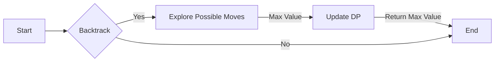

<h2><a href="https://leetcode.com/problems/stone-game-iii">1406. Stone Game III</a></h2>

<p>Alice and Bob continue their games with piles of stones. There are several stones <strong>arranged in a row</strong>, and each stone has an associated value which is an integer given in the array <code>stoneValue</code>.</p>

<p>Alice and Bob take turns, with Alice starting first. On each player's turn, that player can take <code>1</code>, <code>2</code>, or <code>3</code> stones from the <strong>first</strong> remaining stones in the row.</p>

<p>The score of each player is the sum of the values of the stones taken. The score of each player is <code>0</code> initially.</p>

<p>The objective of the game is to end with the highest score, and the winner is the player with the highest score and there could be a tie. The game continues until all the stones have been taken.</p>

<p>Assume Alice and Bob <strong>play optimally</strong>.</p>

<p>Return <code>"Alice"</code><em> if Alice will win, </em><code>"Bob"</code><em> if Bob will win, or </em><code>"Tie"</code><em> if they will end the game with the same score</em>.</p>

<p>&nbsp;</p>
<p><strong class="example">Example 1:</strong></p>

<pre><strong>Input:</strong> stoneValue = [1,2,3,7]
<strong>Output:</strong> "Bob"
<strong>Explanation:</strong> Alice will always lose. Her best move will be to take three piles and the score become 6. Now the score of Bob is 7 and Bob wins.
</pre>

<p><strong class="example">Example 2:</strong></p>

<pre><strong>Input:</strong> stoneValue = [1,2,3,-9]
<strong>Output:</strong> "Alice"
<strong>Explanation:</strong> Alice must choose all the three piles at the first move to win and leave Bob with negative score.
If Alice chooses one pile her score will be 1 and the next move Bob's score becomes 5. In the next move, Alice will take the pile with value = -9 and lose.
If Alice chooses two piles her score will be 3 and the next move Bob's score becomes 3. In the next move, Alice will take the pile with value = -9 and also lose.
Remember that both play optimally so here Alice will choose the scenario that makes her win.
</pre>

<p><strong class="example">Example 3:</strong></p>

<pre><strong>Input:</strong> stoneValue = [1,2,3,6]
<strong>Output:</strong> "Tie"
<strong>Explanation:</strong> Alice cannot win this game. She can end the game in a draw if she decided to choose all the first three piles, otherwise she will lose.
</pre>

<p>&nbsp;</p>
<p><strong>Constraints:</strong></p>

<ul>
	<li><code>1 &lt;= stoneValue.length &lt;= 5 * 10<sup>4</sup></code></li>
	<li><code>-1000 &lt;= stoneValue[i] &lt;= 1000</code></li>
</ul>


---

# 🛍️ Stone-Game-III | Explained

## Approach 1: Memoized Backtracking
### Intuition
The core idea behind this approach is to use memoized backtracking to determine the maximum value that Alice can gain by strategically choosing the number of stones to take in each turn. This approach works by simulating all possible moves for Alice and keeping track of the maximum value she can achieve.

### Algorithm Visualized


### Approach
The approach involves using a recursive function `backtrack` to explore all possible moves for Alice. The function takes a `start` index as input and returns the maximum value that Alice can gain by starting from that index. The function uses a dictionary `dp` to store the maximum values for each index to avoid redundant calculations.

### Detailed Code Analysis
The code starts by initializing an empty dictionary `dp` to store the maximum values for each index. The `backtrack` function is then defined, which takes a `start` index as input. If the `start` index is greater than or equal to the length of the `stoneValue` list, the function returns 0, indicating that there are no more stones to take.

The function then checks if the `start` index is already in the `dp` dictionary. If it is, the function returns the stored value, avoiding redundant calculations.

If the `start` index is not in the `dp` dictionary, the function initializes a variable `res` to negative infinity and a variable `piles` to 0. The function then iterates over the possible moves for Alice, which range from taking 1 stone to taking 3 stones.

For each possible move, the function adds the value of the stones taken to `piles` and updates `res` with the maximum value that Alice can gain by taking those stones and then making the optimal move for the remaining stones.

The function then stores the maximum value for the `start` index in the `dp` dictionary and returns it.

### Code
```python
def stoneGameIII(self, stoneValue: List[int]) -> str:
    n = len(stoneValue)
    dp = {}
    def backtrack(start):
        if start >= n:
            return 0
        if start in dp:
            return dp[start]
        res = float(-inf)
        piles = 0
        for i in range(start, min(n, start + 3)):
            piles += stoneValue[i]
            res = max(res, piles - backtrack(i + 1))
        dp[start] = res
        return res

    ans = backtrack(0)
    if ans > 0:
        return "Alice"
    elif ans < 0:
        return "Bob"
    else:
        return "Tie"
```

### Complexity
- **Time:** O(n) - The time complexity is linear because each index is visited at most once and the number of operations performed at each index is constant.
- **Space:** O(n) - The space complexity is also linear because in the worst case, the `dp` dictionary will store a value for each index in the `stoneValue` list.

## 🕵️‍♂️ Follow-up Questions (Optional)
1. How would you optimize the solution if the `stoneValue` list is very large?
Answer: You can optimize the solution by using a more efficient data structure, such as a segment tree, to store the cumulative sum of the `stoneValue` list. This would allow you to calculate the value of the stones taken in constant time.
2. How would you modify the solution to handle a scenario where the number of stones taken in each turn is not limited to 1-3?
Answer: You can modify the solution by changing the range of the loop in the `backtrack` function to iterate over all possible moves. However, this would increase the time complexity of the solution, so you may need to use a more efficient algorithm or data structure to handle large inputs.