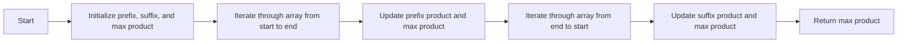

<h2><a href="https://leetcode.com/problems/maximum-product-subarray">152. Maximum Product Subarray</a></h2>

<p>Given an integer array <code>nums</code>, find a <span data-keyword="subarray-nonempty" class=" cursor-pointer relative text-dark-blue-s text-sm"><button type="button" aria-haspopup="dialog" aria-expanded="false" aria-controls="radix-_r_1j_" data-state="closed" class="">subarray</button></span> that has the largest product, and return <em>the product</em>.</p>

<p>The test cases are generated so that the answer will fit in a <strong>32-bit</strong> integer.</p>

<p><strong>Note</strong> that the product of an array with a single element is the value of that element.</p>

<p>&nbsp;</p>
<p><strong class="example">Example 1:</strong></p>

<pre><strong>Input:</strong> nums = [2,3,-2,4]
<strong>Output:</strong> 6
<strong>Explanation:</strong> [2,3] has the largest product 6.
</pre>

<p><strong class="example">Example 2:</strong></p>

<pre><strong>Input:</strong> nums = [-2,0,-1]
<strong>Output:</strong> 0
<strong>Explanation:</strong> The result cannot be 2, because [-2,-1] is not a subarray.
</pre>

<p>&nbsp;</p>
<p><strong>Constraints:</strong></p>

<ul>
	<li><code>1 &lt;= nums.length &lt;= 2 * 10<sup>4</sup></code></li>
	<li><code>-10 &lt;= nums[i] &lt;= 10</code></li>
	<li>The product of any subarray of <code>nums</code> is <strong>guaranteed</strong> to fit in a <strong>32-bit</strong> integer.</li>
</ul>


---

# 🛍️ Maximum-Product-Subarray | Explained

## Approach 1: Prefix and Suffix Product Calculation
### Intuition
The core idea of this approach is to maintain the maximum product of subarrays ending at each position from the start and end of the array. This is done by calculating the prefix and suffix product separately and updating the maximum product found so far. The reason this approach works is that the maximum product of a subarray can be obtained by either extending the current subarray to the left or right or by starting a new subarray.

### Algorithm Visualized


### Approach
The algorithm works by iterating through the array twice: once from the start to the end and once from the end to the start. During the first iteration, it updates the prefix product and the maximum product found so far. During the second iteration, it updates the suffix product and the maximum product found so far.

### Detailed Code Analysis
The code starts by initializing an empty stack (although it's not used anywhere in the code), `curr` variable to `None`, `prefix` and `suffix` products to 1, and `res` (maximum product) to negative infinity. It then iterates through the array from the start to the end. If the current element is 0, it resets the `prefix` product to 1 and updates the `res` if the current element is greater than the current `res`. If the current element is not 0, it multiplies the `prefix` product by the current element and updates the `res` if the new `prefix` product or the current element is greater than the current `res`. The same process is repeated for the `suffix` product by iterating through the array from the end to the start.

### Code
```python
class Solution:
    def maxProduct(self, nums: List[int]) -> int:
        prefix = 1
        suffix = 1
        res = float('-inf')
        n = len(nums)
        for i in range(n):
            if nums[i] == 0:
                prefix = 1
                res = max(res, nums[i])
            else:
                prefix *= nums[i]
                res = max(res, prefix, nums[i])

        for i in range(n):
            if nums[n-i-1] == 0:
                res = max(res, nums[n-i-1])
                suffix = 1
            else:
                suffix *= nums[n-i-1]
                res = max(res, suffix, nums[n-i-1])
        return res
```

### Complexity
- **Time:** O(n) where n is the number of elements in the input array. This is because we are making two passes through the array, one from the start to the end and one from the end to the start.
- **Space:** O(1) as we are only using a constant amount of space to store the prefix, suffix, and maximum product variables. The space complexity does not grow with the size of the input array.

## Approach 2: None
There is only one approach in the provided code. The stack and `curr` variable are initialized but not used anywhere in the code, suggesting that there might have been an attempt to implement a different approach but it was not completed or was removed. 

## 🕵️‍♂️ Follow-up Questions (Optional)
Some common follow-up questions for this pattern are:
- What if the input array contains very large or very small numbers? How would you handle overflow or underflow?
- Can you optimize the solution to use less space or improve the time complexity?
Answers to these questions would involve discussing the use of arbitrary-precision arithmetic or a more efficient algorithm that avoids redundant calculations.