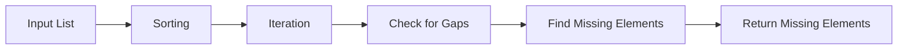

<h2><a href="https://leetcode.com/problems/find-missing-elements">3731. Find Missing Elements</a></h2>

<p>You are given an integer array <code>nums</code> consisting of <strong>unique</strong> integers.</p>

<p>Originally, <code>nums</code> contained <strong>every integer</strong> within a certain range. However, some integers might have gone <strong>missing</strong> from the array.</p>

<p>The <strong>smallest</strong> and <strong>largest</strong> integers of the original range are still present in <code>nums</code>.</p>

<p>Return a <strong>sorted</strong> list of all the missing integers in this range. If no integers are missing, return an <strong>empty</strong> list.</p>

<p>&nbsp;</p>
<p><strong class="example">Example 1:</strong></p>

<div class="example-block">
<p><strong>Input:</strong> <span class="example-io">nums = [1,4,2,5]</span></p>

<p><strong>Output:</strong> <span class="example-io">[3]</span></p>

<p><strong>Explanation:</strong></p>

<p>The smallest integer is 1 and the largest is 5, so the full range should be <code>[1,2,3,4,5]</code>. Among these, only 3 is missing.</p>
</div>

<p><strong class="example">Example 2:</strong></p>

<div class="example-block">
<p><strong>Input:</strong> <span class="example-io">nums = [7,8,6,9]</span></p>

<p><strong>Output:</strong> <span class="example-io">[]</span></p>

<p><strong>Explanation:</strong></p>

<p>The smallest integer is 6 and the largest is 9, so the full range is <code>[6,7,8,9]</code>. All integers are already present, so no integer is missing.</p>
</div>

<p><strong class="example">Example 3:</strong></p>

<div class="example-block">
<p><strong>Input:</strong> <span class="example-io">nums = [5,1]</span></p>

<p><strong>Output:</strong> <span class="example-io">[2,3,4]</span></p>

<p><strong>Explanation:</strong></p>

<p>The smallest integer is 1 and the largest is 5, so the full range should be <code>[1,2,3,4,5]</code>. The missing integers are 2, 3, and 4.</p>
</div>

<p>&nbsp;</p>
<p><strong>Constraints:</strong></p>

<ul>
	<li><code>2 &lt;= nums.length &lt;= 100</code></li>
	<li><code>1 &lt;= nums[i] &lt;= 100</code></li>
</ul>


---

# 🛍️ Find-Missing-Elements | Explained

## Approach 1: Sorting-Based Approach
### Intuition
This approach works by first sorting the input list, which allows us to easily identify gaps between consecutive elements. The idea is to iterate through the sorted list and check for missing elements by comparing each element with its next one.

### Algorithm Visualized


### Approach
The algorithm starts by sorting the input list in ascending order. Then, it iterates through the sorted list, checking for gaps between consecutive elements. If a gap is found, it means that there are missing elements, so the algorithm adds these missing elements to the result list.

### Detailed Code Analysis
The code starts by sorting the input list `nums` using the `sort()` method. This is done to ensure that the elements are in ascending order, making it easier to identify gaps.

The code then initializes an empty list `res` to store the missing elements.

The outer loop iterates through the sorted list, checking each element with its next one. If the current element is not equal to the next element minus one, it means that there is a gap, and the inner loop is executed to find the missing elements.

The inner loop iterates from the current element plus one to the next element, adding each missing element to the `res` list.

Finally, the code returns the `res` list, which contains all the missing elements.

### Code
```python
class Solution:
    def findMissingElements(self, nums: List[int]) -> List[int]:
        nums.sort()
        res = []
        for i in range(len(nums) - 1):
            if nums[i] != nums[i + 1] - 1:
                for j in range(nums[i] + 1, nums[i + 1]):
                    res.append(j)
        return res
```

### Complexity
- **Time:** O(n log n) due to the sorting operation, where n is the number of elements in the input list. The subsequent for loops have a total time complexity of O(n), but this is dominated by the sorting operation.
- **Space:** O(n) for the output list `res` in the worst case, where all elements are missing. The input list `nums` is sorted in-place, so no extra space is used for sorting.

## 🕵️‍♂️ Follow-up Questions (Optional)
1. What if the input list is already sorted? How would you optimize the solution in that case?
 Answer: If the input list is already sorted, you can skip the sorting step and directly iterate through the list to find missing elements. This would reduce the time complexity to O(n).
2. How would you handle duplicate elements in the input list?
 Answer: To handle duplicate elements, you can modify the inner loop to only add missing elements that are not already present in the `res` list. Alternatively, you can use a set to store the missing elements and then convert it to a list before returning.