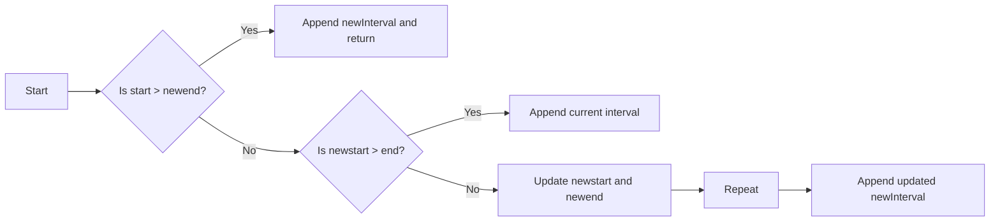

<h2><a href="https://leetcode.com/problems/insert-interval">57. Insert Interval</a></h2>

<p>You are given an array of non-overlapping intervals <code>intervals</code> where <code>intervals[i] = [start<sub>i</sub>, end<sub>i</sub>]</code> represent the start and the end of the <code>i<sup>th</sup></code> interval and <code>intervals</code> is sorted in ascending order by <code>start<sub>i</sub></code>. You are also given an interval <code>newInterval = [start, end]</code> that represents the start and end of another interval.</p>

<p>Two intervals are considered overlapping if they share <strong>at least</strong> one point.</p>

<p>Insert <code>newInterval</code> into <code>intervals</code> such that <code>intervals</code> is still sorted in ascending order by <code>start<sub>i</sub></code> and <code>intervals</code> still does not have any overlapping intervals (merge overlapping intervals if necessary).</p>

<p>Return <code>intervals</code><em> after the insertion</em>.</p>

<p><strong>Note</strong> that you don't need to modify <code>intervals</code> in-place. You can make a new array and return it.</p>

<p>&nbsp;</p>
<p><strong class="example">Example 1:</strong></p>

<pre><strong>Input:</strong> intervals = [[1,3],[6,9]], newInterval = [2,5]
<strong>Output:</strong> [[1,5],[6,9]]
</pre>

<p><strong class="example">Example 2:</strong></p>

<pre><strong>Input:</strong> intervals = [[1,2],[3,5],[6,7],[8,10],[12,16]], newInterval = [4,8]
<strong>Output:</strong> [[1,2],[3,10],[12,16]]
<strong>Explanation:</strong> Because the new interval [4,8] overlaps with [3,5],[6,7],[8,10].
</pre>

<p>&nbsp;</p>
<p><strong>Constraints:</strong></p>

<ul>
	<li><code>0 &lt;= intervals.length &lt;= 10<sup>4</sup></code></li>
	<li><code>intervals[i].length == 2</code></li>
	<li><code>0 &lt;= start<sub>i</sub> &lt;= end<sub>i</sub> &lt;= 10<sup>5</sup></code></li>
	<li><code>intervals</code> is sorted by <code>start<sub>i</sub></code> in <strong>ascending</strong> order.</li>
	<li><code>newInterval.length == 2</code></li>
	<li><code>0 &lt;= start &lt;= end &lt;= 10<sup>5</sup></code></li>
</ul>


---

# 🛍️ Insert-Interval | Explained

## Approach 1: Merging Intervals
### Intuition
This approach works by iterating through the given intervals and merging the new interval with any overlapping intervals. The core idea is to maintain a running list of non-overlapping intervals, which is achieved by updating the start and end of the new interval whenever an overlap is found.

### Algorithm Visualized


### Approach
The algorithm starts by initializing an empty list `res` to store the merged intervals and extracting the start and end of the new interval. It then iterates through the given intervals, checking for three possible cases:
- If the current interval's start is greater than the new interval's end, it means the new interval has been fully merged and can be appended to the result list.
- If the new interval's start is greater than the current interval's end, it means the current interval does not overlap with the new interval and can be appended to the result list as is.
- If neither of the above conditions is true, it means the current interval overlaps with the new interval, so the new interval's start and end are updated to be the minimum and maximum of the two intervals' start and end, respectively.

### Detailed Code Analysis
The code initializes an empty list `res` and extracts the start and end of the new interval into `newstart` and `newend`. The `for` loop iterates through the given intervals using `enumerate` to get both the index and the interval values. Inside the loop, the code checks the three cases mentioned above and updates the `res` list and the `newstart` and `newend` variables accordingly. Finally, the updated `newstart` and `newend` are appended to the `res` list, and the resulting list is returned.

### Code
```python
class Solution:
    def insert(self, intervals: List[List[int]], newInterval: List[int]) -> List[List[int]]:
        res = []
        newstart, newend = newInterval
        for index, (start, end) in enumerate(intervals):
            if start > newend:
                res.append([newstart, newend])
                return res + intervals[index:]
            elif newstart > end:
                res.append([start, end])
            else:
                newstart, newend = [min(newstart, start), max(newend, end)]
        res.append([newstart, newend])
        return res
```

### Complexity
- **Time:** O(n), where n is the number of intervals. This is because the algorithm iterates through the given intervals once, and the operations inside the loop take constant time.
- **Space:** O(n), where n is the number of intervals. This is because the algorithm creates a new list to store the merged intervals, which can have up to n intervals in the worst case.

## 🕵️‍♂️ Follow-up Questions (Optional)
1. What if the input intervals are not sorted by their start value? Can the algorithm still work?
   - No, the algorithm relies on the input intervals being sorted by their start value. If they are not sorted, the algorithm would need to be modified to sort the intervals first.
2. How would you handle the case where the input intervals are empty?
   - The algorithm already handles this case correctly by appending the new interval to the empty list and returning it.