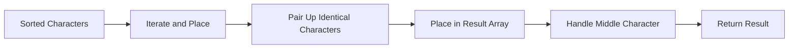

<h2><a href="https://leetcode.com/problems/smallest-palindromic-rearrangement-i">3517. Smallest Palindromic Rearrangement I</a></h2>

<p>You are given a <strong><span data-keyword="palindrome-string">palindromic</span></strong> string <code>s</code>.</p>

<p>Return the <strong><span data-keyword="lexicographically-smaller-string">lexicographically smallest</span></strong> palindromic <span data-keyword="permutation-string">permutation</span> of <code>s</code>.</p>

<p>&nbsp;</p>
<p><strong class="example">Example 1:</strong></p>

<div class="example-block">
<p><strong>Input:</strong> <span class="example-io">s = &quot;z&quot;</span></p>

<p><strong>Output:</strong> <span class="example-io">&quot;z&quot;</span></p>

<p><strong>Explanation:</strong></p>

<p>A string of only one character is already the lexicographically smallest palindrome.</p>
</div>

<p><strong class="example">Example 2:</strong></p>

<div class="example-block">
<p><strong>Input:</strong> <span class="example-io">s = &quot;babab&quot;</span></p>

<p><strong>Output:</strong> <span class="example-io">&quot;abbba&quot;</span></p>

<p><strong>Explanation:</strong></p>

<p>Rearranging <code>&quot;babab&quot;</code> &rarr; <code>&quot;abbba&quot;</code> gives the smallest lexicographic palindrome.</p>
</div>

<p><strong class="example">Example 3:</strong></p>

<div class="example-block">
<p><strong>Input:</strong> <span class="example-io">s = &quot;daccad&quot;</span></p>

<p><strong>Output:</strong> <span class="example-io">&quot;acddca&quot;</span></p>

<p><strong>Explanation:</strong></p>

<p>Rearranging <code>&quot;daccad&quot;</code> &rarr; <code>&quot;acddca&quot;</code> gives the smallest lexicographic palindrome.</p>
</div>

<p>&nbsp;</p>
<p><strong>Constraints:</strong></p>

<ul>
	<li><code>1 &lt;= s.length &lt;= 10<sup>5</sup></code></li>
	<li><code>s</code> consists of lowercase English letters.</li>
	<li><code>s</code> is guaranteed to be palindromic.</li>
</ul>


---

# 🛍️ Smallest-Palindromic-Rearrangement-I | Explained

## Approach 1: Greedy Character Placement
### Intuition
This approach works by first sorting the characters in the input string and then placing them in the result array in a way that minimizes the length of the resulting palindrome. The idea is to pair up identical characters and place them symmetrically around the center of the result array.

### Algorithm Visualized


### Approach
The algorithm starts by sorting the characters in the input string. Then, it iterates over the sorted characters and places them in the result array in a way that minimizes the length of the resulting palindrome. If two identical characters are found, they are placed symmetrically around the center of the result array. If a single character is left at the end, it is placed in the middle of the result array.

### Detailed Code Analysis
The code starts by sorting the characters in the input string using the `sorted` function and joining them into a string `k`. The length of the input string is stored in `n`. An array `arr` of size `n` is created to store the result, and an index `index` is used to keep track of the current position in the sorted string. A variable `fill` is used to keep track of the number of pairs of identical characters that have been placed in the result array.

The code then enters a loop that continues until the end of the sorted string is reached. Inside the loop, the code checks if the current character is the same as the next character. If they are different, the current character is placed in the middle of the result array, and the index is incremented. If the characters are the same, they are placed symmetrically around the center of the result array, and the index is incremented by 2.

Finally, if the middle of the result array is still empty, the last character of the sorted string is placed there.

### Code
```python
class Solution:
    def smallestPalindrome(self, s: str) -> str:
        k = ''.join(sorted(s))
        n = len(s)
        arr = ['_'] * n
        index = 0
        fill = 0
        
        while index < n - 1:
            if k[index] != k[index + 1]:
                arr[n // 2] = k[index]
                index += 1
            else:
                arr[fill] = arr[n - fill - 1] = k[index]
                index += 2
                fill += 1 
        if arr[n // 2] == '_':
            arr[n // 2] = k[n - 1]
        
        return ''.join(arr)
```

### Complexity
- **Time:** O(n log n) due to the sorting operation, where n is the length of the input string. The subsequent loop has a time complexity of O(n), but it is dominated by the sorting operation.
- **Space:** O(n) for the result array and the sorted string.

## Approach 2: Not applicable
There is only one approach in the provided code.

## 🕵️‍♂️ Follow-up Questions (Optional)
What would be the approach if the input string can contain duplicate characters? 
- The approach would remain the same, as the algorithm already handles duplicate characters by pairing them up and placing them symmetrically around the center of the result array. 
What if the input string can be very large and the sorting operation is too expensive? 
- In that case, a more efficient sorting algorithm or a different approach that does not rely on sorting could be used.