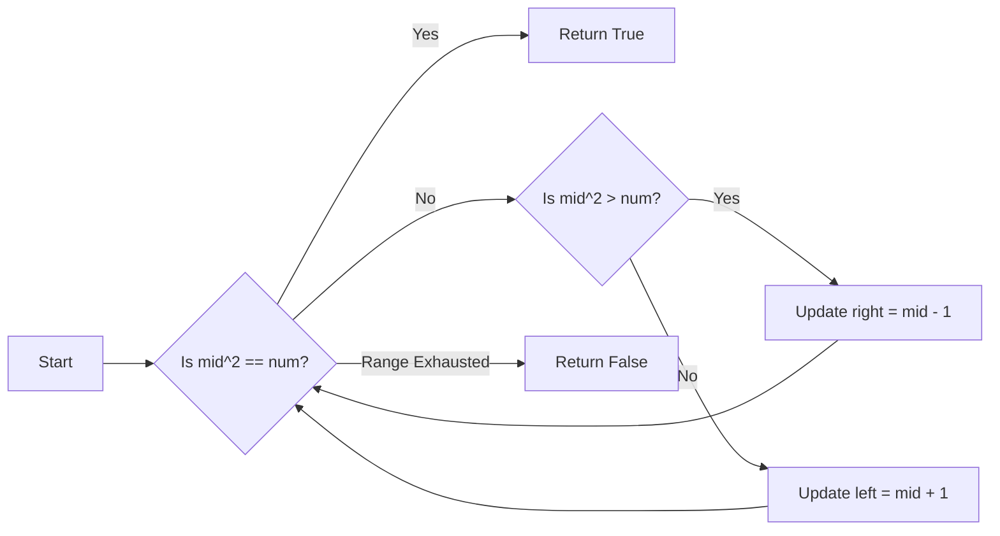

<h2><a href="https://leetcode.com/problems/valid-perfect-square">367. Valid Perfect Square</a></h2>

<p>Given a positive integer num, return <code>true</code> <em>if</em> <code>num</code> <em>is a perfect square or</em> <code>false</code> <em>otherwise</em>.</p>

<p>A <strong>perfect square</strong> is an integer that is the square of an integer. In other words, it is the product of some integer with itself.</p>

<p>You must not use any built-in library function, such as <code>sqrt</code>.</p>

<p>&nbsp;</p>
<p><strong class="example">Example 1:</strong></p>

<pre><strong>Input:</strong> num = 16
<strong>Output:</strong> true
<strong>Explanation:</strong> We return true because 4 * 4 = 16 and 4 is an integer.
</pre>

<p><strong class="example">Example 2:</strong></p>

<pre><strong>Input:</strong> num = 14
<strong>Output:</strong> false
<strong>Explanation:</strong> We return false because 3.742 * 3.742 = 14 and 3.742 is not an integer.
</pre>

<p>&nbsp;</p>
<p><strong>Constraints:</strong></p>

<ul>
	<li><code>1 &lt;= num &lt;= 2<sup>31</sup> - 1</code></li>
</ul>


---

# 🛍️ Valid-Perfect-Square | Explained

## Approach 1: Binary Search
### Intuition
The approach uses a binary search strategy to efficiently find whether a given number is a perfect square. This works by iteratively narrowing down the search range until a match is found or the range is exhausted, leveraging the fact that perfect squares are densely packed and have a clear ordering.

### Algorithm Visualized


### Approach
The algorithm starts by defining the initial search range `[left, right]`, where `left` is set to 1 and `right` is set to the input number `num`. It then enters a loop where it calculates the midpoint `mid` of the current range. The square of `mid` is compared to `num`. If they are equal, the algorithm returns `True`, indicating that `num` is a perfect square. If the square of `mid` is greater than `num`, the algorithm updates the `right` boundary of the search range to `mid - 1`. Otherwise, it updates the `left` boundary to `mid + 1`. This process repeats until `num` is found to be a perfect square or the search range is exhausted, in which case the algorithm returns `False`.

### Detailed Code Analysis
- Line 1: The class `Solution` is defined, containing the method `isPerfectSquare` that takes an integer `num` as input and returns a boolean.
- Line 2: The method `isPerfectSquare` is defined, which implements the binary search algorithm.
- Lines 3-4: The initial search range is defined with `left` set to 1 and `right` set to `num`.
- Line 5: The loop continues as long as `left` is less than or equal to `right`.
- Line 6: The midpoint `mid` of the current range is calculated using integer division `(left + right) // 2`.
- Line 7: The square of `mid` is calculated and stored in `sqr`.
- Lines 8-9: If `sqr` equals `num`, the method immediately returns `True`.
- Lines 10-11: If `sqr` is greater than `num`, the `right` boundary is updated to `mid - 1`.
- Lines 12-13: Otherwise, the `left` boundary is updated to `mid + 1`.
- Line 15: If the loop completes without finding a match, the method returns `False`, indicating that `num` is not a perfect square.

### Code
```python
class Solution:
    def isPerfectSquare(self, num: int) -> bool:
        left = 1
        right = num
        while left <= right:
            mid = (left + right) // 2
            sqr = mid * mid
            if sqr == num:
                return True
            if sqr > num:
                right = mid - 1
            else:
                left = mid + 1
        
        return False
```

### Complexity
- **Time:** O(log n), where n is the input number `num`. This is because with each iteration of the while loop, the search space is halved, which is the hallmark of logarithmic time complexity.
- **Space:** O(1), as the space used does not grow with the size of the input `num`. The algorithm only uses a constant amount of space to store the variables `left`, `right`, `mid`, and `sqr`.

## 🕵️‍♂️ Follow-up Questions
1. **What if the input number is negative?** The current implementation does not handle negative numbers. A perfect square is always positive (or zero), so the function could immediately return `False` for any negative input.
2. **How would you optimize this for very large inputs?** The current implementation is already optimized for large inputs due to its logarithmic time complexity. However, for extremely large inputs that exceed the maximum limit of the integer data type, considerations such as using arbitrary-precision arithmetic might be necessary.