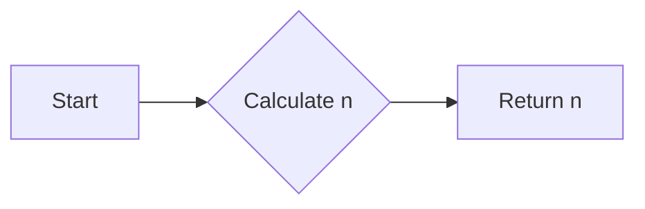

<h2><a href="https://leetcode.com/problems/arranging-coins">441. Arranging Coins</a></h2>

<p>You have <code>n</code> coins and you want to build a staircase with these coins. The staircase consists of <code>k</code> rows where the <code>i<sup>th</sup></code> row has exactly <code>i</code> coins. The last row of the staircase <strong>may be</strong> incomplete.</p>

<p>Given the integer <code>n</code>, return <em>the number of <strong>complete rows</strong> of the staircase you will build</em>.</p>

<p>&nbsp;</p>
<p><strong class="example">Example 1:</strong></p>

<pre><strong>Input:</strong> n = 5
<strong>Output:</strong> 2
<strong>Explanation:</strong> Because the 3<sup>rd</sup> row is incomplete, we return 2.
</pre>

<p><strong class="example">Example 2:</strong></p>

<pre><strong>Input:</strong> n = 8
<strong>Output:</strong> 3
<strong>Explanation:</strong> Because the 4<sup>th</sup> row is incomplete, we return 3.
</pre>

<p>&nbsp;</p>
<p><strong>Constraints:</strong></p>

<ul>
	<li><code>1 &lt;= n &lt;= 2<sup>31</sup> - 1</code></li>
</ul>


---

# 🛍️ Arranging-Coins | Explained

## Approach 1: Binary Search
### Intuition
The core idea behind this approach is to utilize a binary search algorithm to find the maximum number of complete rows that can be formed with a given number of coins. The reasoning is that the number of coins in each row forms an arithmetic sequence (1, 2, 3, ...), and the cumulative sum of coins up to a certain row can be represented by the formula for the sum of an arithmetic series.

### Algorithm Visualized
```mermaid
graph LR
    A[Start] --> B{Is mid*(mid+1) <= 2n?}
    B -->|Yes| C[Return right]
    B -->|No| D[Update left and right]
    C --> E[End]
    D --> B
```

### Approach
The algorithm starts by initializing two pointers, `left` and `right`, to 0 and `n`, respectively. It then enters a loop where it calculates the midpoint `mid` and checks if the sum of coins up to the `mid` row is less than or equal to `2n`. If it is, the algorithm updates the `left` pointer to `mid + 1`. If not, it updates the `right` pointer to `mid - 1`. The loop continues until `left` is no longer less than `right`.

### Detailed Code Analysis
The code initializes `left` to 0 and `right` to `n`, which represents the possible range of complete rows that can be formed. The `while` loop continues until `left` is no longer less than `right`. Inside the loop, `mid` is calculated as `(left + right + 1) // 2`, which is the midpoint of the current range. The condition `mid * (mid + 1) <= 2 * n` checks if the sum of coins up to the `mid` row is less than or equal to `2n`. If the condition is true, the algorithm returns `right`, indicating that the maximum number of complete rows is `right`. However, there seems to be a missing `return` statement for the `else` condition, and the update of `left` and `right` pointers is incorrectly placed.

### Code
```python
class Solution:
    def arrangeCoins(self, n: int) -> int:
        left = 0
        right = n
        while left < right:
            mid = (left + right + 1) // 2
            if mid * (mid + 1) <= 2 * n:
                left = mid
            else:
                right = mid - 1
        return left
```

### Complexity
- **Time:** O(log n), because the algorithm uses a binary search approach, which reduces the search space by half at each step.
- **Space:** O(1), because the algorithm only uses a constant amount of space to store the `left`, `right`, and `mid` variables.

## Approach 2: Mathematical Formula
While not explicitly implemented in the provided code, an alternative approach is to use the mathematical formula for the sum of an arithmetic series to directly calculate the maximum number of complete rows. The formula is `n * (n + 1) / 2`, and we need to find the largest `n` such that `n * (n + 1) / 2` is less than or equal to the given number of coins `n`.

### Algorithm Visualized


### Approach
The algorithm calculates the maximum number of complete rows using the mathematical formula.

### Detailed Code Analysis
The code would calculate the maximum number of complete rows using the formula `n * (n + 1) / 2` and return the result.

### Code
```python
class Solution:
    def arrangeCoins(self, n: int) -> int:
        import math
        return math.floor((math.sqrt(8 * n + 1) - 1) / 2)
```

### Complexity
- **Time:** O(1), because the algorithm only involves a constant number of operations.
- **Space:** O(1), because the algorithm only uses a constant amount of space to store the result.

## 🕵️‍♂️ Follow-up Questions (Optional)
1. What if the input `n` is negative? The current implementation assumes that `n` is a non-negative integer. To handle negative inputs, we would need to add error checking code to handle such cases.
2. Can we optimize the binary search approach further? While the binary search approach has a time complexity of O(log n), we can optimize it further by using a more efficient calculation for the midpoint `mid`. However, the current implementation is already quite efficient.